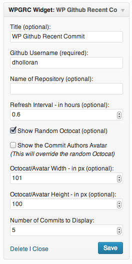

#WP Github Recent Commit

**Description:** Wordpress widget that grabs a random Octocat from the octodex and the latest commit from the master branch of a public GitHub repository

**Plugin Home Page:** [http://wordpress.org/extend/plugins/wp-github-recent-commit/](http://wordpress.org/extend/plugins/wp-github-recent-commit/)

Check out a [demo](http://demo.danholloran.com/github-commit-widget-demo/) here.

**Thanks to:** If your project is included and I do not have you added please let me know, thank you.

If you have any issues please submit an [issue](https://github.com/DHolloran/wp-github-recent-commit/issues/new) or fix it/submit a pull request I will try to handle it ASAP. You an also contact me at [Dan@danholloran.com](mailto:dan@danholloran.com).

##Screenshots

##Getting Started
To get started with WP Github Recent Commit you can download it directly [here](https://github.com/DHolloran/wp-github-recent-commit/archive/master.zip), search for WP Github Recent Commit in your administrator section's Plugins > Add New, or you can download it from the [Wordpress plugins directory](http://wordpress.org/extend/plugins/wp-github-recent-commit/)

###Wordpress Plugin Directory Instructions
1. Search for WP Github Recent Commit in Plugins > Add New
2. Install &amp; Activate WP Github Recent Commit

###Manual Install Instructions
1. Unzip your download and place in wp-content/plugins/
2. Activate WP Github Recent Commit in the Wordpress Admin area

###Using the widget
1. Go to Appearance > Widgets drag the WP Github Recent Commit widget to the sidebar area of your choice
2. Fill in your GitHub username and set the rest of the options

###Using the function
1. Place this code in your template file
2. Add a user name and set any other options

		if ( function_exists('wpgrc') ) {
			wpgrc( array(
				'id'				=>	"1", // optional, used for caching purposes
				'username'			=>	'', // required, it just won't work with out it
				'repository'		=>	"", // optional, if not it will just be the last commit from all repos for the username
				'refresh_interval'	=>	"0.5", // optional default 0.5hrs aka 30min
				'show_octocat'		=>	"true", // optional boolean default true
				'octocat_width'		=>	"100", // optional int default 100
				'octocat_height'	=>	"100" // optional int default 100
				'commit_count'		=>	"1", // optional int default 1
				'show_avatar'		=>	false  // optional boolean default false
			) );
		}

###Using the shortcode
1. Place in your admin editor `[wpgrc id="1" username="" repository="" refresh_interval="0.5" show_octocat="true" octocat_width="100" octocat_height="100" commit_count="1" show_avatar="false"]`
2. Add a user name and set any other options
